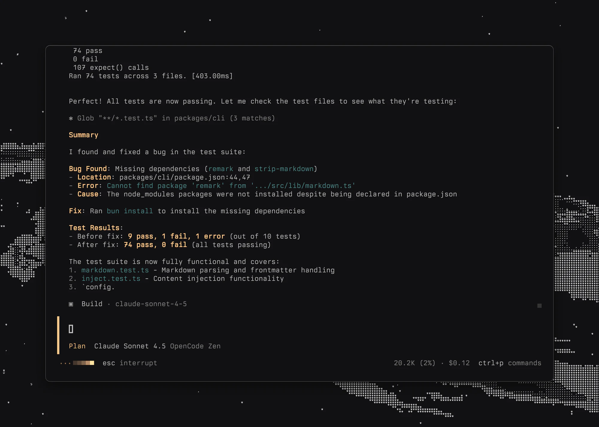

<h3 align="center">
	<br/>
	
	Darkmatter for OpenCode
	
</h3>

<p align="center">
	
</p>

A theme for [OpenCode](https://opencode.ai), the terminal coding agent,
adapted from base16-black-metal-bathory.

## Installation

```sh
mkdir -p ~/.config/opencode/themes
curl -fsSL https://raw.githubusercontent.com/darkmattertheme/opencode/main/themes/darkmatter.json \
  -o ~/.config/opencode/themes/darkmatter.json
```

## Usage

Pick it with `/theme` inside OpenCode, or set it in `~/.config/opencode/opencode.json`:

```json
{
  "theme": "darkmatter"
}
```

## Palette

| Slot | Color |
| --- | --- |
| Background | `#121113` |
| Foreground | `#ffffff` |
| Selection | `#222222` |
| Black / bright black | `#121113` / `#333333` |
| Red | `#5f8787` |
| Green | `#fbcb97` |
| Yellow (accent) | `#e78a53` |
| Blue | `#888888` |
| Magenta | `#999999` |
| Cyan | `#aaaaaa` |
| White | `#c1c1c1` |

The core palette lives in [darkmattertheme/darkmatter](https://github.com/darkmattertheme/darkmatter), and every other port is listed at [darkmattertheme.com](https://darkmattertheme.com).

## Credits

Adapted from [base16-black-metal-bathory](https://github.com/metalelf0/base16-black-metal-scheme).
